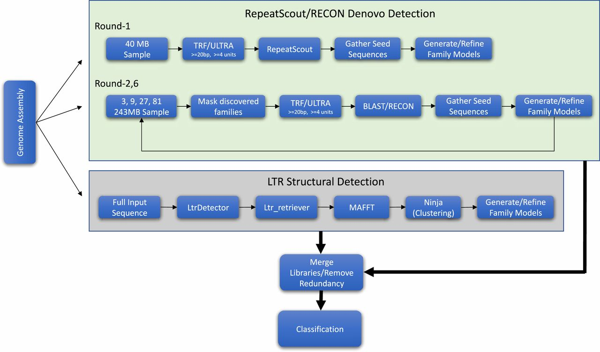
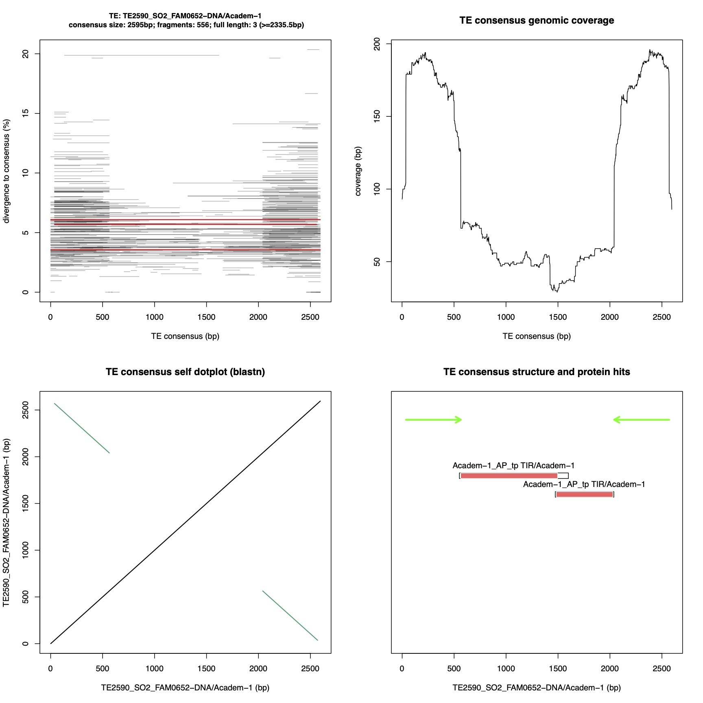
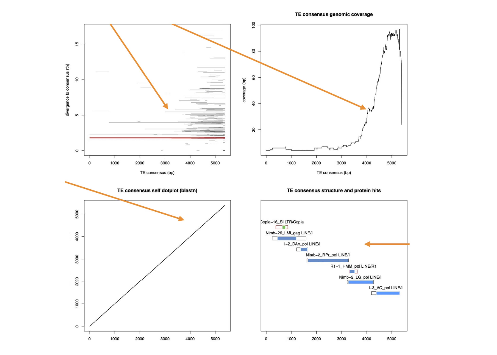
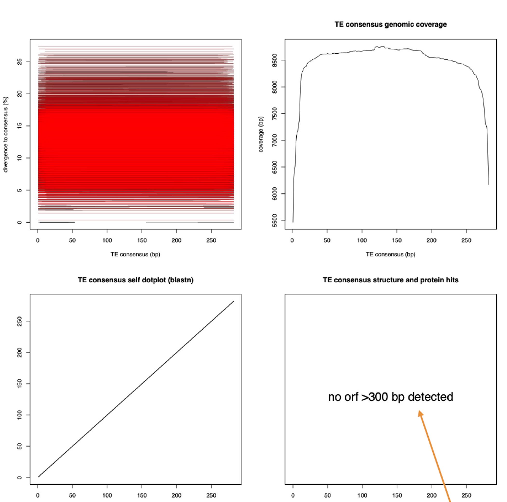
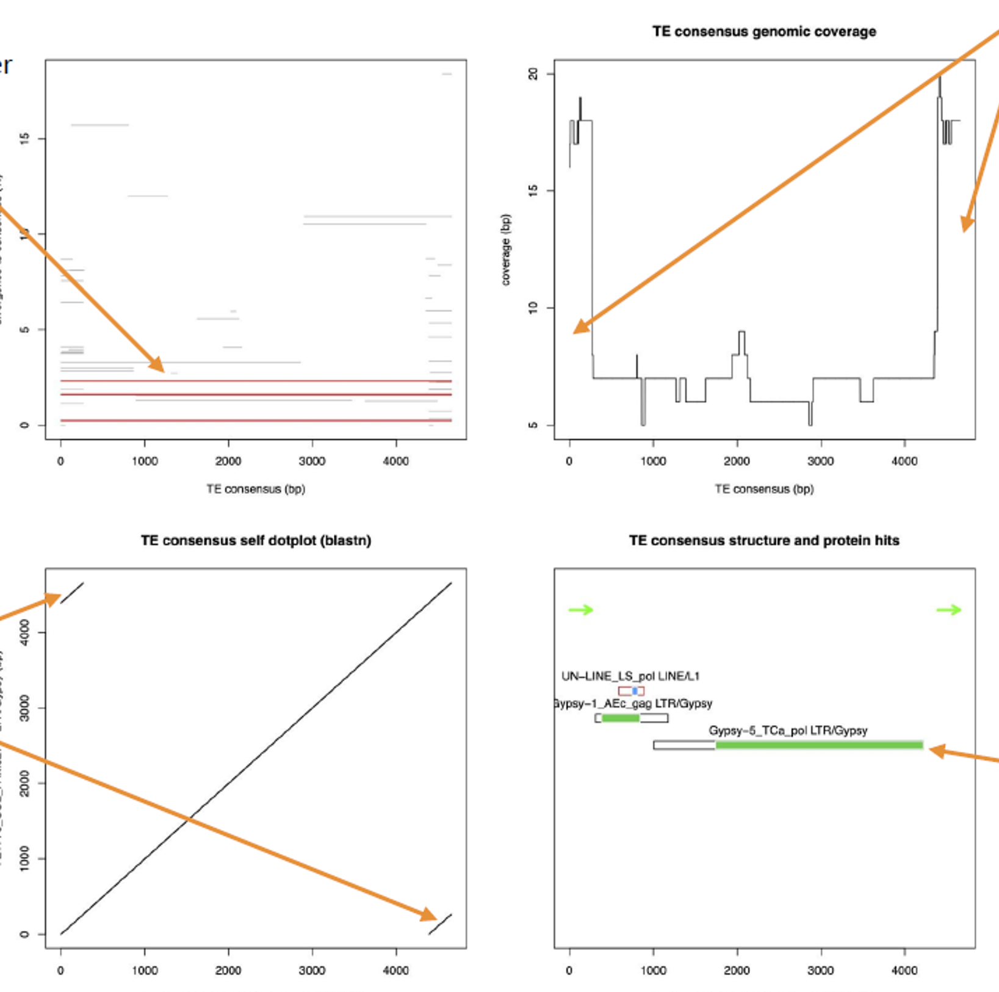
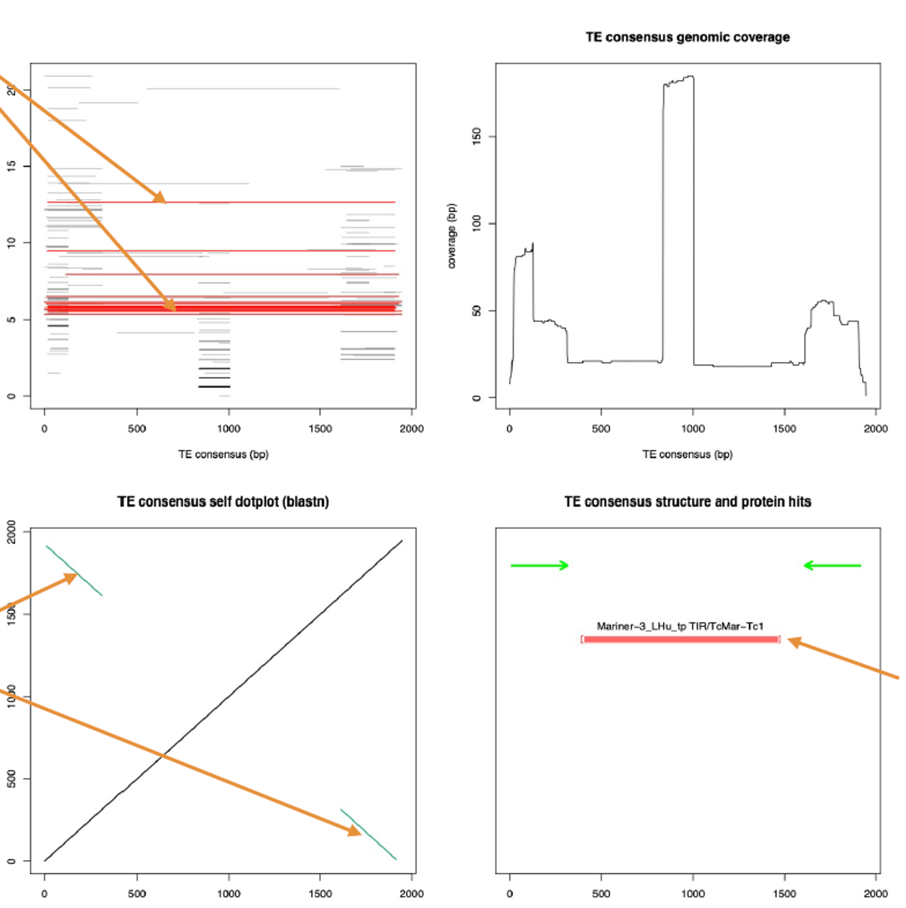
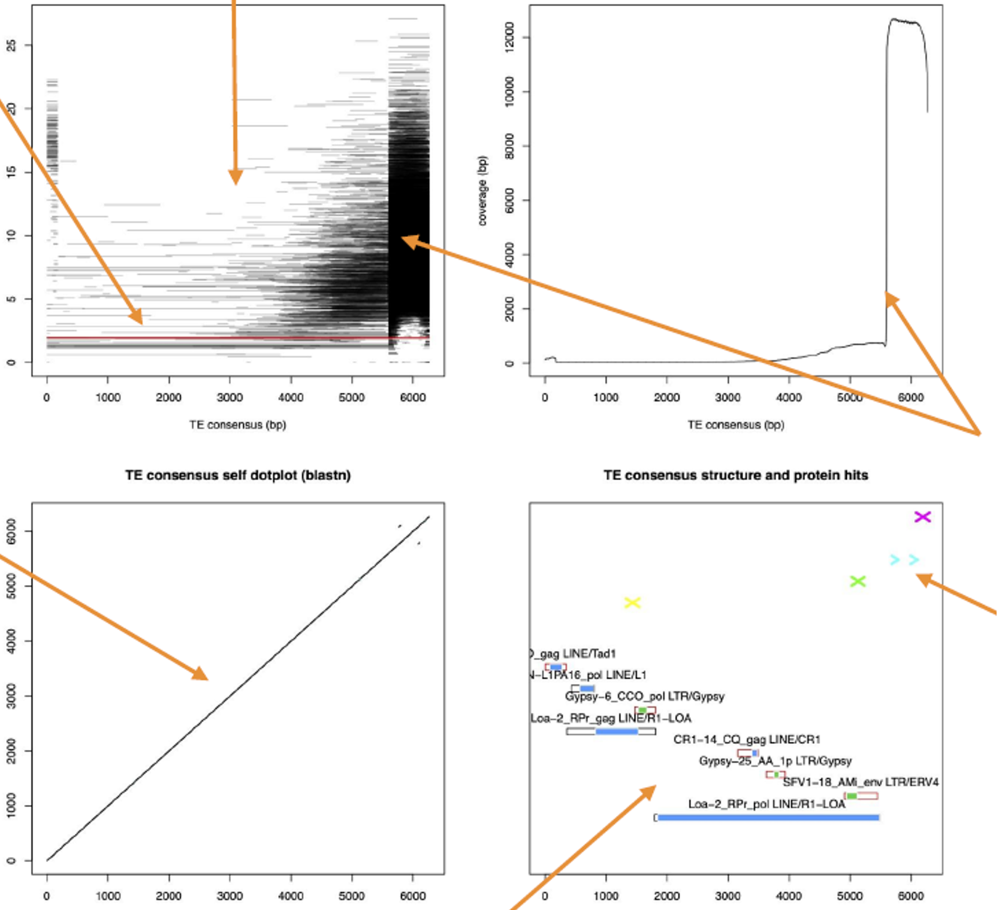
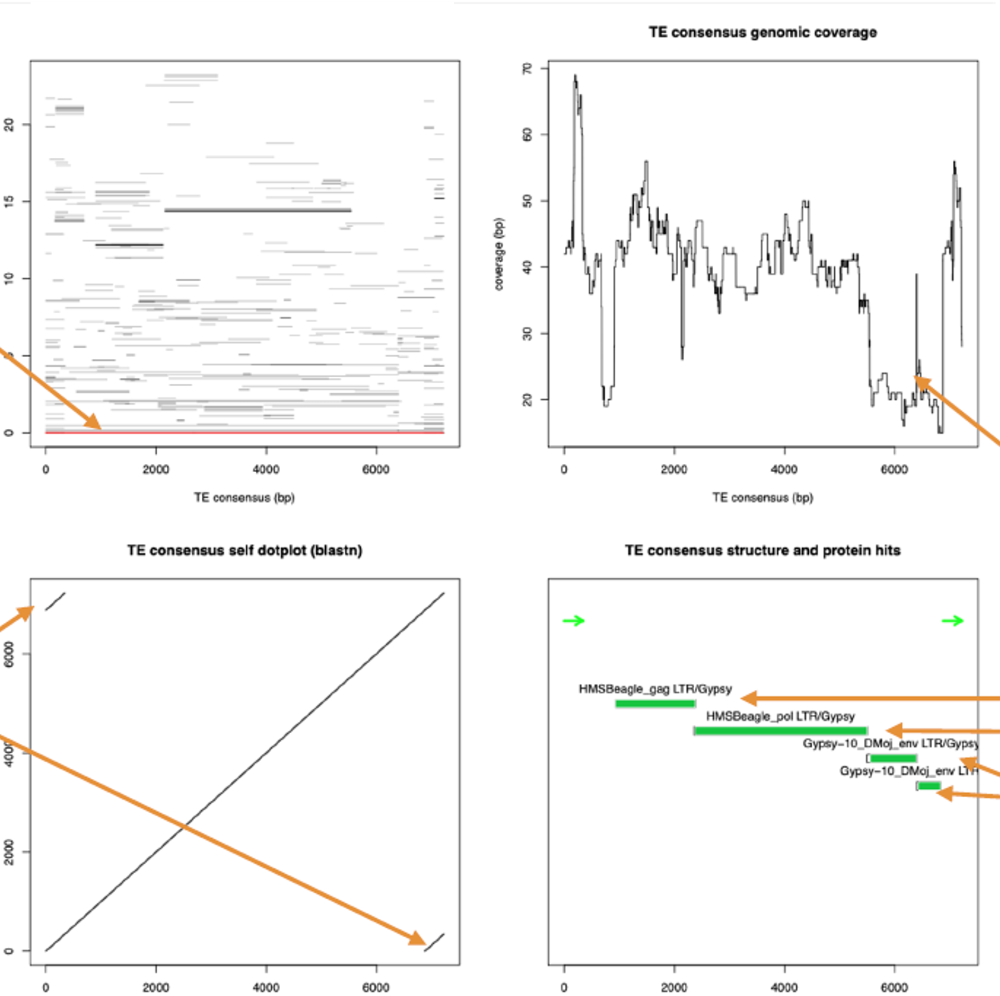
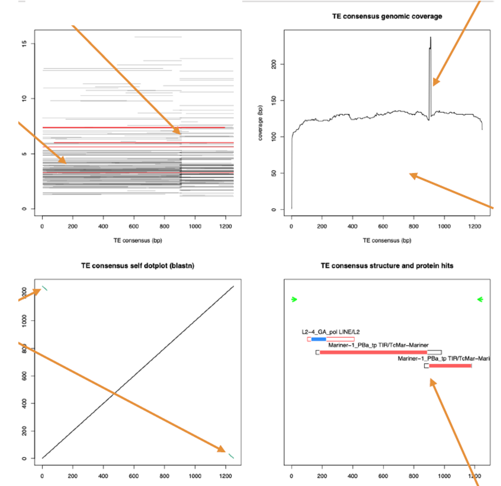
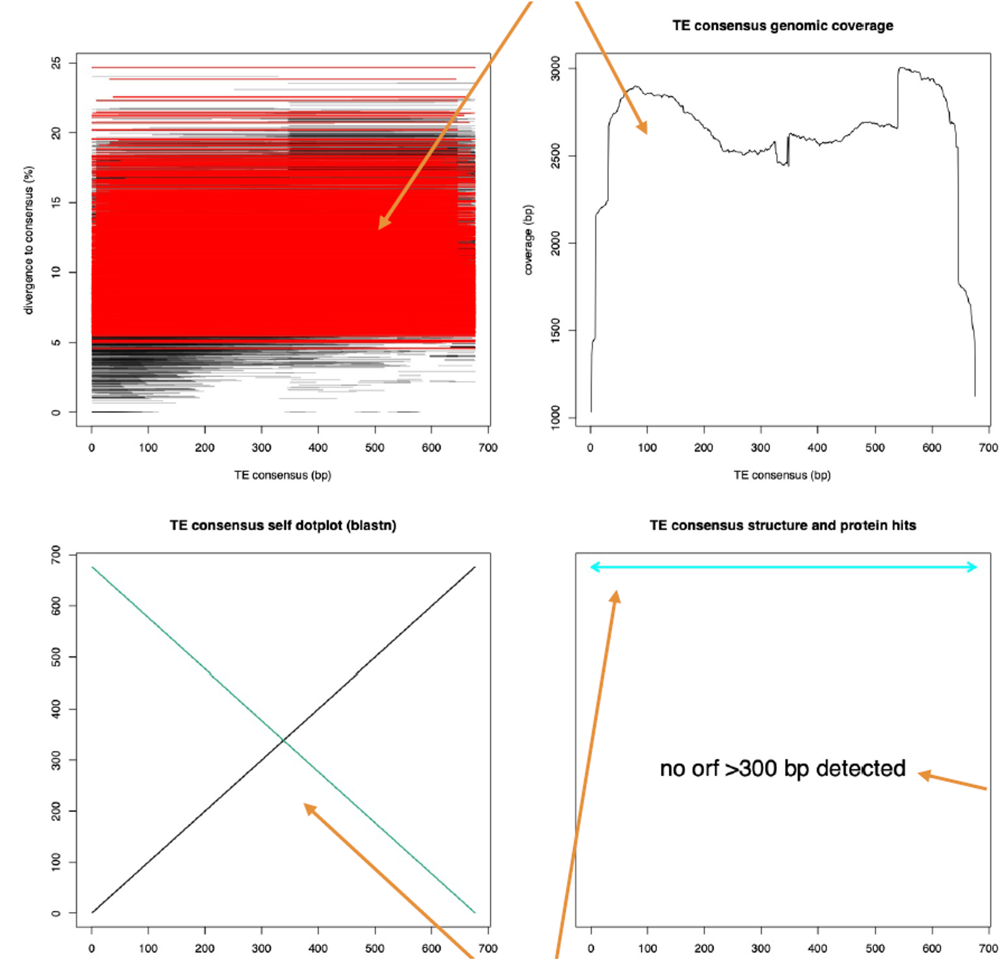

# Introduction to transposable element annotation
> 2025 Workshop on Genomics, Cesky Krumlov - 16th January 2025

**Valentina Peona**

*valentina.peona@nrm.se*

## Table of contents
- [Introduction](#Introduction)
- [Run RepeatModeler2](#RepeatModeler2)
- [Run RepeatMasker](#RepeatMasker)
- [Create a repeat landscape](#RepeatLandscape)
- [TE databases](#Databases)
- [TE Hub](#TEHub)
- [Exploration of TE diversity](#TEdiversity)

## Introduction <a name="introduction"></a>
The characterisation of the diversity and location of transposable elements in a genome can be key for many analyses. Sometimes it is important to know their sequences and where they are to directly study them, sometimes it is important to know their coordinates to avoid them! For example, it is necessary to get rid of transposable elements (or repetitive elements in general) when annotating host genes or when refining your SNP calls and running popgen-related downstream analyses (e.g., nucleotide diversity, selection scans).

Whatever the reason you look at TEs, everything starts with the:

1) **characterisation of the diversity** of repetitive elements in your genome of interest by creating a de-novo library of consensus sequences or by retrieving the consensus sequences from databases. We are going to create a de-novo library using [RepeatModeler2](https://www.pnas.org/doi/10.1073/pnas.1921046117).

2) **annotation** of the repetitive elements, namely the identification of the coordinates of the repeats in a genome and their sequence nature (also referred to as "genome masking") using a library of known TEs. We are going to use [RepeatMasker](https://www.repeatmasker.org/) for this task.

---

This tutorial will guide you through the use of these two softwares and at the end of this activity you should know how to:

<p align="center"> 📖 <strong>Learning objectives</strong> 📖 </p>

- [ ] create of a de-novo repeat library using RepeatModeler2
- [ ] describe what a repeat library and consensus sequences are
- [ ] use a repeat library to annotate repeats in a genome with RepeatMasker
- [ ] find already characterised consensus sequences in a database for your species of interest
- [ ] explore some key sequence characteristics of TEs to distinguish the main TE categories

---

## 1) De-novo creation of a repeat library - RepeatModeler2 <a name="RepeatModeler2"></a>

Let's start from the beginning and create a library of representative sequences (consensus sequences) for all the types of repetitive elements present in our genome of interest.

:memo: **Libraries and consensus sequences** :memo:

> A TE family (that can be seen as a species) can be represented by a consensus sequence approximating that of the ancestral progenitor. Such consensus sequence can be created on top of a multiple alignment of individual genomic copies (or “seeds”) from which each ancestral nucleotide can be inferred based on a majority rule along the alignment. Similarly, the seed alignment may be used to generate a profile Hidden Markov Model (HMM) for each family. [Flynn et al., 2020](https://www.pnas.org/doi/10.1073/pnas.1921046117)

A library of consensus sequences will then be essential to find sequences in the genome of interest that are similar to the consensus sequences themselves, namely the different copies of the TEs.

A good repeat library has these characteristics:

🟢 is complete - the entire diversity of repeats is represented

🟢 contains nonredundant consensus sequences - each element is represented only once

🟢 contains full-length consensus sequences - each elements is not fragmented/truncated

If you work on model organisms, it is very likely that the diversity of transposable elements of your species has already been characterised and that you can find a library of consensus sequences avaialable on databases like [Repbase](https://www.girinst.org/repbase/) and [Dfam](https://dfam.org/). In this case, it is not essential to run tools like RepeatModeler2. This can be true also if your species of interest is closely related to a species whose transposable elements have been already characterised. However, we find over and over that masking a genome of a new species using repeat libraries from other species can be insufficient. This happens when the genome of interest contains species-specific repetitive elements never described before and these elements would remain largely unmasked or partially and/or incorrectly annotated. Furthermore, curated repeat libraries from sister species can actually reciprocally help the annotation of the two genomes [Boman et al. 2018](https://www.mdpi.com/2073-4425/10/4/301).

There are a few tools available for the de-novo characterisation of repeats (e.g., CARP, REPET, EarlGrey, RepeatExplorer2 and other all listed in https://tehub.org) but for time reasons we will use only RepeatModeler2. As target genome, we chose to use the assembled chromosomes of the wheatear *Oenanthe melanoleuca* (GCA_029582105.1) [Peona et al. 2023](https://academic.oup.com/g3journal/article/13/6/jkad088/7141353). 


#### Let's run RepeatModeler2!!

:warning: **Warning:** Given the short time we have today, you will not be able to fully run the RepeatModeler2 commands, therefore we generated all the output for you that can be found in the folder `~/workshop_materials/transposable_elements/Outputs`. I suggest you to follow the tutorial and try the commands out but kill the analysis right after. All the output necessary is available to you in any moment!

A run of RepeatModeler2 on a genome consists of two steps:

- indexing of the genome (somewhat similar to what bwa index does) using the command `BuildDatabase`
- clustering of similar sequences to create the de-novo library using the command `RepeatModeler`

<p align="center"><figure><figcaption><strong>Figure 1.</strong> RepeatModeler2 pipeline. Image from <a href="https://www.pnas.org/doi/10.1073/pnas.1921046117">Flynn et. al 2020</a>.</figcaption></figure></p>

The core of the RepeatModeler2 pipeline (illustrated above in **Figure 1**) consists of up to 6 rounds of sequence subsampling of your genome. Each round subsamples chunks of your genome of different sizes and on each of these chunks, several tools are run to identify both tandem and interspersed repeats. At the end of each round, multisequence alignments of repetitive elements are created and consensus sequences are produced on top of them and stored in the `consensi.fa` file. RepeatModeler2 can also run an optional additional pipeline called LTRstruct particularly dedicated to improve the characterisation of LTR retrotransposons.

Before running the first commands, let's set some variables for the most used files and paths

```bash
# activate conda environment
conda activate transposable_elements

WD=~/workshop_materials/transposable_elements
OUTDIR=$WD/Results
REF=$WD/Genomes/oenMel.fasta

# go to working directory
cd $WD

# create output folders
mkdir -p $OUTDIR/RepeatModeler2 $OUTDIR/RepeatMasker
```

Call the command `BuildDatabase`, look at the options and run it on `oenMel.fasta` genome.

```bash
BuildDatabase
```

<details>
    <summary><strong>BuildDatabase command</strong></summary>

```bash
# BuildDatabase takes about 1 minute to run
cd $WD

BuildDatabase -name $REF $REF
```

</details>

Now that your index/database is ready, we can run RepeatModeler2 on it.

As before, call the `RepeatModeler` command and look at the options. Which options would you use?

Below you can find how I ran RepeatModeler2 on `oenMel.fasta`.

<details>
    <summary><strong>RepeatModeler command</strong></summary>

```bash
cd $WD

# Run RepeatModeler2 with the LTR pipeline
RepeatModeler -database $REF -threads 8 -LTRStruct
```

</details>

:warning: **Warning:** Once you managed to start RepeatModeler2, let it run for a minute or two (or until you lose your patience) to see the very first round of repeat prediction start and then please kill the command with `Ctrl + C` as we do not have the time to let it finish. You will see that a folder with a name similar to this `RM_1962636.MonJan131517222025` has been created in your working directory that contains the intermediate files of the RepeatModeler2 pipeline. You can give it a look and then you can jump directly to the final output files of the pipeline.

:exclamation: Copy the output from the `Outputs` folder to your `Results` folder:

```bash
cd $WD
cp -r $WD/Outputs/RepeatModeler2 $OUTDIR/
```

📖 **Let's give a look at the output of RepeatModeler2** 📖

Go to your `Results` folder and list the files present there.

:question::question: **Questions** :question::question:

🔴 What files do you find? What is the difference between a fasta file and a Stockholm file?

🔴 What is the difference between the classified and non-classified fasta files?

🔴 What is a consensus sequence?

🔴 Do you see shortcomings in the use of consensus sequences to annotate repeats?

🔴 Do you think this library is complete, non-redundant and contains full-length elements? (Just reflect on this, it is difficult to know at this stage.)

🔴 What types of repeats are found in your library? Use the classified version of the library to answer this.

🔴 Do you think this library contains only transposable elements?


<details>
    <summary><strong>Answers</strong></summary>

<strong>What files do you find?</strong>
In the <code>Results</code> folder you find the final output of RepeatModeler2. Note that the intermediate files have been removed. RepeatModeler2 creates a huge amount of intermediate files that are useful essentially to resume a run that failed.
<br>
The fasta and Stockholm files contain the consensus sequences generated by the tool. While the fasta file can be directly used by RepeatMasker, the Stockholm file can be used to create HMM profiles and be used by other HMM-based tools.
<br>

```
consensi.fa  : Consensus sequences
consensi.fa.classified: Consensus sequences classified
families.stk : Seed alignments
families-classified.stk: Seed alignments classified
```

<br>

<strong>What is the difference between the classified and non-classified fasta files?</strong>
The difference lies in the headers of the fasta files. In the classified version you find a tag after the name of the repeat that specifies (when possible) the type of repeat. Note that this classification can be partial and sometimes incorrect.
<br><br>

<strong>What is a consensus sequence? Do you see shortcomings in the use of consensus sequences to annotate repeats?</strong>
A consensus sequence is an approximation of the ancestral repeat that gave rise to the insertions found in the genome. Note that a consensus sequence is made on top of a set of similar (and likely homologous) repetitive elements, therefore it represents an approximation of the ancestor of that limited set of aligned sequences therefore could not capture the entire variability of that family of TE.
<br><br>

<strong>Do you think this library is complete, non-redundant and contains full-length elements?</strong>
Most likely, the repeat library just produced here does not meet all these criteria. Likely it is incomplete because low copy number repeats are still difficult to identify and build a consensus on top of a very few sequences. Likely some of the consensus sequences are not full-length because of the nature of the transposable elements (e.g., LINEs and 5' truncation) or because of the fragmentation of the genome used. However, the library should rather be non-redundant because RepeatModeler2 has a step in the pipeline that gets rid of most of the redundancy. It is good practice to check for it! <br> A library can be improved with some manual curation!
<br><br>

<strong>Do you think this library contains only transposable elements?</strong> The library likely contains also tandem repeats but it can also contain multi-copy genes. RepeatModeler2 takes care of removing gene-related sequences but it is still possible that some genes remain. You can check for it using blast or tools like <a href="https://github.com/NBISweden/ProtExcluder">ProtExcluder</a>.


</details>


The library produced here contains quite a lot of consensus sequences but possibly it is not of the best quality.

For the scope of this tutorial, we are going to use the library as it is but for more detailed analyses I warmly recommend to curate the library manually with the help of some tools (eg., TE-Aid) or using longer pipelines that build on top of RepeatModeler2 output and automatically curate your consensus sequences. Automatic curation and classification are great but be aware that they are not perfect and at least a general knowledge of the manual curation process is recommended before trusting the result of such pipeline as it is.

:note: Note that the header names of the consensus sequences in the `consensi.fa.classified` follows a precise nomenclature and style which is necessary for RepeatMasker to give you correct abundance estimates for each kind of TE.

---

<p align="center"> 🔎 <strong>Further readings and tools</strong> 🔎 </p>

- [A beginner’s guide to manual curation of transposable elements](https://link.springer.com/article/10.1186/s13100-021-00259-7). This guide includes several protocols, videos and code.
- [Earl Grey: A Fully Automated User-Friendly Transposable Element Annotation and Analysis Pipeline](https://academic.oup.com/mbe/article/41/4/msae068/7635926). Example of a tool to get an automatically curated repeat library.

---

## 2) Annotation of transposable elements - RepeatMasker <a name="RepeatMasker"></a>

Now that we have a new repeat library for our genome of interest, we can finally find where the transposable element insertions are and in what abundance with RepeatMasker!

Let's be sure that all our variables are correctly set

```bash
LIB=$OUTDIR/RepeatModeler2/consensi.fa.classified
```

As first thing, let's look at the manual of the tool. To do that just call the `RepeatMasker -help` command (it prints a very long manual) and explore the options. Which options would you use? Below the command I used.


<details>
    <summary><strong>RepeatMasker command</strong></summary>

```bash
cd $WD

# for a sensitive search -s
RepeatMasker -pa 8 -s -gff -gccalc -a -excln -lib $LIB -dir $OUTDIR/RepeatMasker $REF

# for a faster search -q
RepeatMasker -pa 8 -q -gff -gccalc -a -excln -lib $LIB -dir $OUTDIR/RepeatMasker $REF
```

</details>

:warning: **Warning:** Once you managed to start RepeatMasker, wait a again a couple of minutes for you to see the analysis start but then please kill the command with `Ctrl + C` as we do not have the time to let it finish.

:exclamation: Copy the entire output from the `Outputs` folder to your `Results` folder:

```bash
cd $WD
cp -r $WD/Outputs/RepeatMasker $OUTDIR/
```

Look at the output files of RepeatMasker (especially the `.tbl` and `.out` files) and answer the questions.

:question::question: **Questions** :question::question:

🔴 What's the difference between `-species` and `-lib` options?

🔴 What do all the columns in the `.out` file mean? What does divergence mean?

🔴 Can you hypothesise what it means when two or more rows share the same ID number (last column) in the `.out` file?

<details>
    <summary><strong>Answers</strong></summary>

<strong>What's the difference between `-species` and `-lib` options?</strong> The species option will enable you to use directly the TE libraries included in the installation of RepeatMasker. The lib option takes any custom library provided by the user. For model organisms, the species option is preferable because their TE libraries have been thouroughly curated and their structure allow RepeatMasker to perform a more detailed search.
<br>
<strong>What do all the columns in the `.out` file mean? What does divergence mean?</strong> You can read a detailed description of the RepeatMasker output on its website under the section ["How to read the results"](https://www.repeatmasker.org/webrepeatmaskerhelp.html).
<br>
<strong>Can you hypothesise what it means when two or more rows share the same ID number (last column) in the `.out` file?</strong> Sadly, sometimes TEs are broken up in multiple pieces. RepeatMasker tries to identify which fragments belong to the same ancestral TE insertion and labels those fragments with the same ID value.
<br>
</details>
<br>


## Create a repeat landscape

Now we can run one little donwstream analysis to visualise the abundance of repeats in your genome of interest using the scripts available from the RepeatMasker tool suite.

We use two Perl scripts. The first `calcDivergenceFromAlign.pl` uses the `.align` file to recalculate the divergence of each hit from its consensus sequence and creates a `.divsum` file which summarises the abundances of each repeat at different percentages of divergence. The `.divsum` file is then used by the script `createRepeatLandscape.pl` to create a barplot where you can explore the abundance of each type of repeats found in the genome at different divergence percentages.

```bash
cd $WD

# it takes about 2 minutes
calcDivergenceFromAlign.pl -s $OUTDIR/RepeatMasker/oenMel.fasta.divsum $OUTDIR/RepeatMasker/oenMel.fasta.align

# it takes a couple of seconds
createRepeatLandscape.pl -div $OUTDIR/RepeatMasker/oenMel.fasta.divsum -g 1200000000 > $OUTDIR/RepeatMasker/oenMel.fasta.html

# download the html file to your local computer and open it on your browser and admire the TEs <3
```

`-g` option requires the size of the genome used, the genome size of our bird is around 1.1 and 1.2 Gb.

If for any reason, the above two Perl scripts do not work for you (they really should!), you can find the output files in `Outputs/Landscapes/`. Copy the files to your working directory and/or to your local computer.

:question::question: **Questions** :question::question:

🔴 Print the help page for `calcDivergenceFromAlign.pl`. Can you see what the script takes into consideration to calculate the divergence that RepeatMasker did not before?

🔴 Copy the `.html` file into your local. Which repeats have been/are likely active in recent time?

🔴 Would you trust the annotation of insertions at very high percentages of divergence? Do you think there is a better way to find them instead of using a fasta model of consensus sequences?

<details>
    <summary><strong>Answers</strong></summary>

<strong>Can you see what the script takes into consideration to calculate the divergence that RepeatMasker did not before?</strong> The script will take CpG sites into consideration when calculating genetic distances, meaning that those sites will not be considered to not inflate such distance because of hypermutability of those sites. You can always decide to include the CpG sites in the calculation with the option <code>-noCpGmode</code>
<br>
<strong>Which repeats have been/are likely active in recent time?</strong> It is usually the case that repeats with low divergence (genetic distance) from the consensus sequence are the most recent and likely the most recently active or currently active. You cannot determine whether they are active from this plot!!! Additional bioinformatic analysis and ideally transposition assay can determine that with more accuracy.
<br>
<strong>Would you trust the annotation of insertions at very high percentages of divergence? Do you think there is a better way to find them instead of using a fasta model of consensus sequences?</strong> Consider that high divergence means that a lot of differences occur between the sequence in the genome and your consensus sequence, meaning that at a certain point you could pick up false positive hits. To investigate very old insertions, it is better to use HMM models instead of fasta ones.
<br>
</details>
<br>

## Databases of known transposable element sequences <a name="Databases"></a>

At present, a lot of TE libraries are being produced for many different species and uploaded to dedicated databases like [Repbase](https://www.girinst.org/repbase/update/browse.php) and Dfam.

I suggest you to go to Repbase or Dfam and look for TE consensus sequences of your species.
Note that unfortunately Repbase requires a subscription to download the sequences but you can still explore them by going to the website and click on the "Browse" option on the top left of the [page](https://www.girinst.org/repbase/update/browse.php).

Also go to [Dfam](https://www.dfam.org/home) and browse for your species! Try to download a consensus sequence from the database, especially try to download the fasta file for a TE of your choice.

🔴 Is the header format suitable for RepeatMasker?

<details>
    <summary><strong>Answer</strong></summary>

Unfortunately, the header given by directly downloading the fasta file from Dfam is not in a RepeatMasker-friendly format. To download a library in the RepeatMasker format, you can use this tool https://github.com/Dfam-consortium/FamDB

</details>
<br>


## TE Hub <a name="TEHub"></a>

TE Hub is a community effort to collect all the TE-related resources and tools and make them easily accessible to everyone. I warmly suggest you to look at the [website](https://www.tehub.org/) if interested in deepening your knowledge of TEs.

For more info you can also read the associated paper published on *Mobile DNA*:

[**TE Hub: A community-oriented space for sharing and connecting tools, data, resources, and methods for transposable element annotation**](https://mobilednajournal.biomedcentral.com/articles/10.1186/s13100-021-00244-0)

>The diversity of available TE-related methods and resources raises compatibility concerns and can be overwhelming to researchers and communicators seeking straightforward guidance or materials. To address these challenges, we have initiated a new resource, TE Hub, that provides a space where members of the TE community can collaborate to document and create resources and methods. The space consists of (1) a website organized with an open wiki framework, https://tehub.org, (2) a conversation framework via a Twitter account and a Slack channel, and (3) bi-monthly Hub Update video chats on the platform’s development. In addition to serving as a centralized repository and communication platform, TE Hub lays the foundation for improved integration, standardization, and effectiveness of diverse tools and protocols.

---

<p align="center"><figure></figure></p>

<p align="center"> <em>Mobile DNA</em> is the main journal of the TE community. Note that its logo is a DNA transposon ❤️ </p>

---

## Exploration of TE diversity <a name="TEdiversity"></a>

<p align="center"><figure></figure></p>

As last part of this tutorial I propose you to give a look at the features of some TE consensus sequences from a couple of organisms (wheatears and tardigrades!) so to get an idea of how to distinguish the different types of TEs and try to classify them. Use the last slides of the lecture where I added some very useful classification tables.

I used [TE-Aid](https://github.com/clemgoub/TE-Aid) (which takes our TE consensus sequences as input (fasta file), aligns them to a reference genome) to produce 4 different plots reporting (**Figure 2**):

- (top left) the genomic hits with divergence to consensus
- (top right) the genomic coverage of the consensus
- (bottom left) a self dot-plot
- (bottom right) a structure analysis including: TIR and LTR suggestions, open reading frames (ORFs) and TE protein hit annotation.

<p align="center"><figure><figcaption><strong>Figure 2.</strong> TE-Aid example output. Image from <a href="https://mobilednajournal.biomedcentral.com/articles/10.1186/s13100-021-00259-7">Goubert et. al 2022</a>.</figcaption></figure></p>


You're also free to try TE-Aid out using the consensus sequences the repeat library we produced here today. Running TE-Aid is rather simple, here how a TE-Aid command looks like:

```bash
TE-Aid [-q|--query <query.TE.fa>] [-g|--genome <genome.fa>] [options]
```

Where the query is your consensus sequence and the genome is the reference assembly.

Investigate the plots with the help of the slides from the lecture AND with the help of the classification tables provided on Github.

Good luck :D

### "Canonical" repeats

**Plot1**

<p align="center"><figure></figure></p>

---

**Plot2**

<p align="center"><figure></figure></p>

---

**Plot3**

<p align="center"><figure></figure></p>

---

**Plot4**

<p align="center"><figure></figure></p>

### More challenging repeats

**Plot5**

<p align="center"><figure></figure></p>

---

**Plot6**

<p align="center"><figure></figure></p>

---

**Plot7**

<p align="center"><figure></figure></p>

---

**Plot8**

<p align="center"><figure></figure></p>
